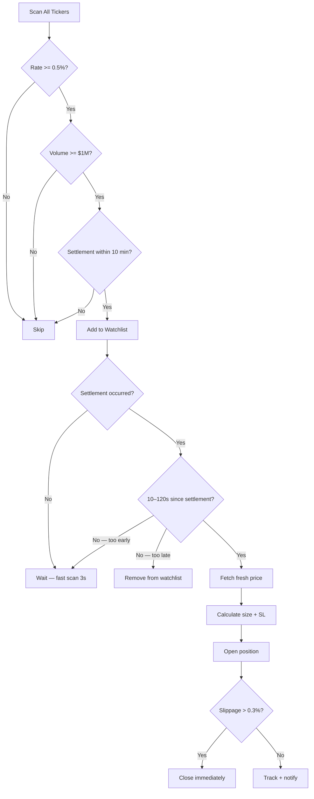
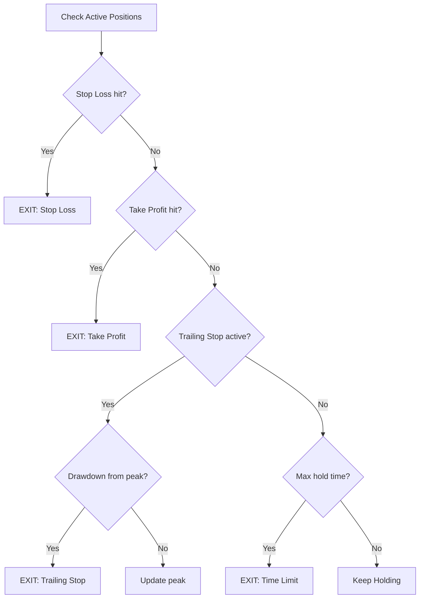

# Funding Fee Farming Strategy Bot

**Designed for Mudrex Futures · Powered by Bybit data**

An automated trading bot that exploits post-settlement price momentum on assets with extreme funding rates.

---

## Table of Contents

- [Overview](#overview)
- [How It Works](#how-it-works)
- [Why Post-Settlement Momentum?](#why-post-settlement-momentum)
- [System Architecture](#system-architecture)
- [Strategy Logic](#strategy-logic)
- [Risk Management](#risk-management)
- [Features](#features)
- [Quick Start](#quick-start)
- [Configuration](#configuration)
- [Deployment](#deployment)
- [Telegram Commands](#telegram-commands)
- [Risk Disclaimers](#risk-disclaimers)
- [License](#license)

---

## Overview

Perpetual futures use **funding rates** to anchor contract prices to spot.
When funding rates become extreme (≥ 0.5%), empirical analysis shows that
price **continues moving in the trend direction after settlement** — often
by 0.7–5% within minutes.

The old approach (enter before settlement, collect the funding fee) has
**negative expected value** because the adverse price move dwarfs the
funding received.

**The new strategy (v4.0):**

1. **Detect** extreme funding rates across all USDT perpetuals.
2. **Watch** — add qualifying symbols to a settlement watchlist.
3. **Wait** for settlement to occur (do NOT enter before).
4. **Enter AFTER settlement** in the momentum direction:
   - Negative funding (bearish) → **SHORT** (price keeps dropping)
   - Positive funding (bullish) → **LONG** (price keeps rising)
5. **Exit** via trailing stop, take-profit, stop-loss, or time limit.

No funding is collected or paid — profit comes from the price move.

---

## How It Works

### Funding Rate → Momentum Signal

| Funding Rate | Sentiment | Post-Settlement Move | Strategy |
|-------------|-----------|---------------------|----------|
| **Deeply negative** (< −0.5%) | Bearish (shorts pay longs) | Price drops further | Open **SHORT** after settlement |
| **Deeply positive** (> +0.5%) | Bullish (longs pay shorts) | Price rises further | Open **LONG** after settlement |

### Empirical Evidence

Analysis of Bybit 1-minute klines around funding settlements:

| Metric | Negative funding (12 events) | Positive funding (7 events) |
|--------|-------|-------|
| Avg move at T+1 min | −0.68% | +0.02% |
| Avg move at T+5 min | −0.73% | +0.02% |
| Avg move at T+30 min | −0.91% | +0.11% |
| Avg 5-min range | 1.24% | 0.55% |
| Avg volume spike | 1.7× | 2.1× |

High-rate examples (ALICE, −2.18% funding): **−5.08% at T+5 min**.

### Profit Calculation

```
Example: ALICE −2.18% funding settlement
├─ Entry: SHORT at T+10s after settlement @ $0.146
├─ Exit:  T+5 min @ $0.1386 (−5.07% move)
├─ Notional: $20 (margin $2 × 10x leverage)
├─ Gross P&L: $20 × 5.07% = $1.01
├─ Fees: 0.06% × 2 = $0.024
└─ Net Profit: $0.99 (49.5% return on margin!)
```

---

## Why Post-Settlement Momentum?

The old "collect funding fee" approach enters BEFORE settlement on the
funding-receiving side. But extreme funding signals strong directional
sentiment. After settlement, the pressure doesn't stop:

- Traders who closed temporarily to avoid paying funding **re-enter**.
- The imbalance that caused the extreme rate **persists**.
- Price moves 2–7× more than the funding fee itself.

**Old strategy simulation** (enter T-5m, exit T+5m, collect funding):
- Avg total P&L: **−0.14%** (negative!)
- Win rate: **37%**

**New strategy** (enter T+10s, exit T+5m, ride momentum):
- Avg price P&L: **+0.73%** for negative-funding events
- No funding cost

---

## System Architecture

```
┌────────────────────────────────────────────────────────────────────┐
│              FUNDING FEE FARMING BOT v4.0                          │
│              Post-Settlement Momentum Strategy                     │
├────────────────────────────────────────────────────────────────────┤
│                                                                    │
│  ┌──────────────────────────────────────────────────────────────┐  │
│  │                    MAIN LOOP (adaptive)                      │  │
│  │  30s normal scan → 3s fast scan near settlement              │  │
│  │                                                              │  │
│  │  1. Scan extreme rates → update watchlist                    │  │
│  │  2. Check watchlist → enter post-settlement positions        │  │
│  │  3. Manage exits → trailing stop / TP / SL / time limit      │  │
│  └──────────────────────────────────────────────────────────────┘  │
│                                                                    │
│  ┌───────────────┐  ┌──────────────┐  ┌──────────────────────┐     │
│  │ Funding       │  │  Strategy    │  │  Trade Executor      │     │
│  │ Fetcher       │→ │  Engine      │→ │  (Mudrex API)        │     │
│  │ (Bybit API)   │  │  • Watchlist │  │  • Open / Close      │     │
│  │ • Rates       │  │  • Timing    │  │  • Position Sizing   │     │
│  │ • Klines      │  │  • Multi-acct│  │  • Stop Loss         │     │
│  └───────────────┘  └──────┬───────┘  └──────────────────────┘     │
│                            │                                       │
│                   ┌────────▼────────┐  ┌────────────────────┐      │
│                   │ Position Manager│  │ Telegram Notifier  │      │
│                   │ • Trailing Stop │  │ • Entry / Exit     │      │
│                   │ • TP / SL       │  │ • /status /stats   │      │
│                   │ • Persistence   │  │ • /kill /live      │      │
│                   └─────────────────┘  └────────────────────┘      │
├────────────────────────────────────────────────────────────────────┤
│  Data: Bybit for prices/rates/klines · Mudrex for execution only   │
└────────────────────────────────────────────────────────────────────┘
```

### Data Sources

| Use Case | Source | Notes |
|----------|--------|-------|
| Funding rates, LTP, klines | Bybit API | Single source of truth for market data |
| PnL calculation | Bot (Bybit LTP) | `(ltp − entry) × qty × direction` |
| SL/TP prices | Bybit LTP | Mudrex SL/TP trigger on LTP, not mark |
| Order execution | Mudrex API | Open/close positions only |

---

## Strategy Logic

### Entry Flow


```mermaid
flowchart TD
    A[Scan All Tickers] --> B{Rate >= 0.5%?}
    B -->|No| Z[Skip]
    B -->|Yes| C{Volume >= $1M?}
    C -->|No| Z
    C -->|Yes| D{Settlement within 10 min?}
    D -->|No| Z
    D -->|Yes| E[Add to Watchlist]
    E --> F{Settlement occurred?}
    F -->|No| G[Wait — fast scan 3s]
    F -->|Yes| H{10–120s since settlement?}
    H -->|No — too early| G
    H -->|No — too late| I[Remove from watchlist]
    H -->|Yes| J[Fetch fresh price]
    J --> K[Calculate size + SL]
    K --> L[Open position]
    L --> M{Slippage > 0.3%?}
    M -->|Yes| N[Close immediately]
    M -->|No| O[Track + notify]
```

### Exit Flow


```mermaid
flowchart TD
    A[Check Active Positions] --> B{Stop Loss hit?}
    B -->|Yes| C[EXIT: Stop Loss]
    B -->|No| D{Take Profit hit?}
    D -->|Yes| E[EXIT: Take Profit]
    D -->|No| F{Trailing Stop active?}
    F -->|Yes| G{Drawdown from peak?}
    G -->|Yes| H[EXIT: Trailing Stop]
    G -->|No| I[Update peak]
    F -->|No| J{Max hold time?}
    J -->|Yes| K[EXIT: Time Limit]
    J -->|No| L[Keep Holding]
```

---

## Risk Management

| Control | Default | Description |
|---------|---------|-------------|
| **Stop Loss** | 0.5% of notional | Hard stop on each trade |
| **Take Profit** | 0.8% of notional | Lock in gains |
| **Trailing Stop** | Activate at 0.3%, callback 0.2% | Let winners run |
| **Max Hold** | 15 minutes | Force exit safety net |
| **Max Slippage** | 0.3% | Closes position if entry slip too high |
| **Max Positions** | 3 | Limits concurrent exposure |
| **Daily Loss Limit** | $10 | Stops new entries if hit |
| **Min Volume** | $1M 24h | Avoids illiquid pairs |
| **Reconciliation** | Every 5 min | Detects liquidations/external closes |

---

## Features

- **Post-settlement momentum** — empirically validated on Bybit klines
- **Settlement watchlist** — tracks extreme-rate symbols, enters after settlement
- **Adaptive scan rate** — 30s normally, 3s near settlement
- **Multi-account** — up to 10 Mudrex API accounts, each with own Telegram chat
- **Trailing stop** — captures the bulk of moves while locking in gains
- **Slippage protection** — closes immediately if entry slippage > 0.3%
- **Position reconciliation** — syncs with exchange every 5 minutes
- **Telegram bot** — `/status`, `/stats`, `/kill`, `/live`, `/help`
- **State persistence** — survives restarts (JSON state file)

---

## Quick Start

### 1. Clone

```bash
git clone https://github.com/DecentralizedJM/funding-fee-farming-strategy.git
cd funding-fee-farming-strategy
```

### 2. Install Dependencies

```bash
pip install -r requirements.txt
```

### 3. Configure

```bash
cp .env.example .env
# Edit .env with your API credentials
```

### 4. Run

```bash
python -m src.main
```

---

## Configuration

All settings in `src/config.py`:

### Core Settings

| Setting | Default | Description |
|---------|---------|-------------|
| `EXTREME_RATE_THRESHOLD` | 0.005 (0.5%) | Minimum absolute funding rate |
| `POST_SETTLEMENT_DELAY_SECONDS` | 10 | Wait after settlement before entering |
| `POST_SETTLEMENT_WINDOW_SECONDS` | 120 | Entry window closes after this |
| `WATCHLIST_SECONDS_BEFORE_SETTLEMENT` | 600 | Start tracking symbols 10 min before |
| `FAST_SCAN_SECONDS` | 3 | Scan interval near settlement |
| `MAX_CONCURRENT_POSITIONS` | 3 | Max simultaneous positions |

### Position Sizing

| Setting | Default | Description |
|---------|---------|-------------|
| `MARGIN_PERCENTAGE` | (env var) | % of futures wallet per position |
| `MIN_LEVERAGE` | 2 | Minimum leverage |
| `MAX_LEVERAGE` | 25 | Maximum leverage |
| `MIN_ORDER_VALUE_USD` | 7.0 | Minimum notional order size |

### Exit Strategy

| Setting | Default | Description |
|---------|---------|-------------|
| `TAKE_PROFIT_PERCENT` | 0.008 (0.8%) | Take profit threshold |
| `STOP_LOSS_PERCENT` | 0.005 (0.5%) | Stop loss threshold |
| `TRAILING_ACTIVATION_PERCENT` | 0.003 (0.3%) | Trailing stop activates here |
| `TRAILING_CALLBACK_PERCENT` | 0.002 (0.2%) | Exit if drops this from peak |
| `MAX_HOLD_MINUTES` | 15 | Hard time limit |
| `MAX_DAILY_LOSS_USD` | 10.0 | Daily loss cap |

---

## Deployment

### Docker Compose

```bash
docker-compose up -d
docker-compose logs -f
```

### Environment Variables

```bash
# Required
MUDREX_API_SECRET_1=your_api_secret
MARGIN_PERCENTAGE=5

# Telegram
TELEGRAM_BOT_TOKEN=your_bot_token
TELEGRAM_CHAT_ID_1=your_chat_id
```

---

## Telegram Commands

| Command | Description |
|---------|-------------|
| `/status` | Bot status, watchlist, countdown to next settlement |
| `/stats` | Trading statistics (win rate, PnL, trades) |
| `/kill` | Pause — stop entering new positions |
| `/live` | Resume — actively scanning |
| `/help` | Show available commands |

---

## Changelog

### v4.0 (Latest) — Post-Settlement Momentum

- **Complete strategy redesign** based on empirical kline analysis
- **Removed** pre-settlement entry (negative EV)
- **Removed** settlement reversal (no longer needed)
- **Added** post-settlement momentum entry (enter AFTER settlement)
- **Added** settlement watchlist — tracks extreme symbols, fires on settlement
- **Added** trailing stop exit for momentum capture
- **Changed** entry direction: SHORT for negative funding, LONG for positive
- **Changed** stop loss from margin-based to notional-based (0.5%)
- **Changed** take profit to 0.8% of notional
- **Simplified** position manager exit logic

### v3.0

- Settlement reversal strategy (close + open opposite after funding)
- Two-phase position tracking
- Combined PnL reporting

### v2.0

- Fixed 6 critical bugs (stop loss, timing, exit logic)
- Funding verification via Bybit API
- Position reconciliation
- Slippage protection

### v1.0

- Initial release

---

## Risk Disclaimers

> **Market Risk**: Post-settlement momentum is a statistical edge, not a guarantee. Individual trades can and will lose money.

> **Execution Risk**: Network delays or API issues could affect entry/exit timing.

> **Leverage Risk**: High leverage amplifies both gains and losses.

> **Not Financial Advice**: This bot is for educational purposes. Use at your own risk.

---

## License

MIT License — see [LICENSE](LICENSE) for details.

---

**Made for Mudrex Futures Trading**
