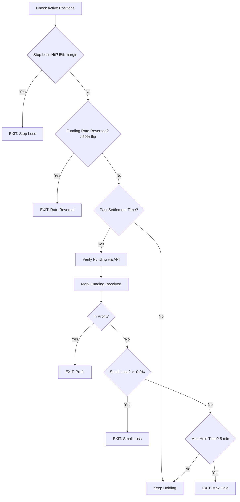

# Funding Fee Farming Strategy Bot

**Designed for Mudrex Futures**

An automated trading bot that farms extreme funding fees by detecting opportunities and opening opposing positions before settlement.

---

## Table of Contents

- [Overview](#overview)
- [How It Works](#how-it-works)
- [System Architecture](#system-architecture)
- [Strategy Logic](#strategy-logic)
- [Risk Management](#risk-management)
- [Features](#features)
- [Quick Start](#quick-start)
- [Configuration](#configuration)
- [Deployment](#deployment)
- [Testing](#testing)
- [Telegram Notifications](#telegram-notifications)
- [Risk Disclaimers](#risk-disclaimers)
- [License](#license)

---

## Overview

Perpetual futures contracts use **funding rates** to keep the contract price aligned with the spot price. When funding rates become extreme (≥0.6%), there's an opportunity to "farm" these fees by taking the opposing position.

**The Strategy:**
1. **Detect** extreme funding rates across all trading pairs
2. **Enter** 30-60 seconds before settlement to minimize price exposure
3. **Receive** funding fees at settlement
4. **Exit** immediately after funding is verified with profit

---

## How It Works

### Funding Rate Basics

| Funding Rate | Who Pays | Strategy Action |
|-------------|----------|-----------------|
| **Positive** (>0) | Longs pay Shorts | Open **SHORT** to receive |
| **Negative** (<0) | Shorts pay Longs | Open **LONG** to receive |

### Profit Calculation

```
Expected Profit = (Position Value × Funding Rate) - (2 × Trading Fee) - Slippage

Example with $2 margin and 10x leverage:
├─ Position Value: $2 × 10 = $20 notional
├─ Funding Rate: 0.6% = $0.12 funding received
├─ Trading Fee: 0.06% × 2 = $0.024
├─ Slippage: ~$0.01
└─ Net Profit: $0.12 - $0.024 - $0.01 = $0.086 (4.3% on margin!)
```

---

## System Architecture

```
┌─────────────────────────────────────────────────────────────────────────────┐
│                      FUNDING FEE FARMING BOT v2.0                           │
├─────────────────────────────────────────────────────────────────────────────┤
│                                                                             │
│  ┌───────────────────────────────────────────────────────────────────────┐  │
│  │                         MAIN LOOP (30s cycle)                         │  │
│  │  ┌─────────────┐  ┌─────────────┐  ┌─────────────┐  ┌─────────────┐   │  │
│  │  │   Daily     │  │  Position   │  │    Scan     │  │   Manage    │   │  │
│  │  │  Summary    │──│ Reconcile   │──│   & Enter   │──│   Exits     │   │  │
│  │  │   Check     │  │  (5 min)    │  │             │  │             │   │  │
│  │  └─────────────┘  └─────────────┘  └─────────────┘  └─────────────┘   │  │
│  └───────────────────────────────────────────────────────────────────────┘  │
│                                                                             │
│  ┌──────────────┐    ┌─────────────────┐    ┌──────────────────────────┐   │
│  │   Funding    │───▶│    Strategy     │───▶│    Trade Executor        │   │
│  │   Fetcher    │    │     Engine      │    │  ┌────────────────────┐  │   │
│  │              │    │                 │    │  │ Slippage Check     │  │   │
│  │ • Rates      │    │ • Entry Window  │    │  │ Position Sizing    │  │   │
│  │ • History    │    │ • Timing Check  │    │  │ Stop Loss Calc     │  │   │
│  │ • Verify     │    │ • Volume Filter │    │  └────────────────────┘  │   │
│  └──────────────┘    └────────┬────────┘    └────────────┬─────────────┘   │
│         │                     │                          │                  │
│         │            ┌────────▼────────┐                 │                  │
│         │            │    Position     │◀────────────────┘                  │
│         │            │    Manager      │                                    │
│         │            │                 │                                    │
│         │            │ • Exit Logic    │                                    │
│         │            │ • Margin-Based  │                                    │
│         │            │   Stop Loss     │                                    │
│         │            │ • Funding Verify│                                    │
│         │            └────────┬────────┘                                    │
│         │                     │                                             │
│         │            ┌────────▼────────┐                                    │
│         │            │    Telegram     │                                    │
│         └───────────▶│    Notifier     │                                    │
│                      └─────────────────┘                                    │
│                                                                             │
├─────────────────────────────────────────────────────────────────────────────┤
│                              EXTERNAL APIs                                  │
│  ┌─────────────────┐                              ┌─────────────────────┐   │
│  │    Bybit API    │                              │     Mudrex API      │   │
│  │  • Funding Rates│                              │   • Open Position   │   │
│  │  • Instrument   │                              │   • Close Position  │   │
│  │  • History      │                              │   • Get PnL         │   │
│  └─────────────────┘                              └─────────────────────┘   │
│                                                                             │
├─────────────────────────────────────────────────────────────────────────────┤
│                              DATA LAYER                                     │
│  ┌─────────────┐  ┌─────────────┐  ┌─────────────────────────────────────┐  │
│  │ state.json  │  │ trades.json │  │           farming.log              │  │
│  │ (positions) │  │  (history)  │  │    (structured logging)            │  │
│  └─────────────┘  └─────────────┘  └─────────────────────────────────────┘  │
└─────────────────────────────────────────────────────────────────────────────┘
```

### Component Overview

| Component | Description |
|-----------|-------------|
| **Funding Fetcher** | Fetches real-time funding rates, instrument info, and verifies funding settlements via Bybit API |
| **Strategy Engine** | Main orchestration - scans opportunities, manages timing, handles reconciliation |
| **Trade Executor** | Executes trades via Mudrex API with position sizing and stop loss calculation |
| **Position Manager** | Tracks positions, handles margin-based exit logic, persists state |
| **Telegram Notifier** | Sends alerts for entries, exits, errors, and daily summaries |

---

## Strategy Logic

### Entry Flow (Improved v2.0)


### Exit Flow (Improved v2.0)



### Key Improvements in v2.0

| Issue | Before | After |
|-------|--------|-------|
| Entry Window | 1-5 minutes | 30s-1 minute |
| Stop Loss | 0.5% of notional (too tight) | 5% of margin |
| Funding Verification | Assumed after 30s | Verified via API |
| Position Count | Checked once | Re-checked before each entry |
| Reversal Threshold | 0.01% (too sensitive) | 50% of original rate |
| Slippage Protection | None | Close if >0.3% |
| Position Reconciliation | On PnL error only | Every 5 minutes |

---

## Risk Management

### Stop Loss Calculation (Margin-Based)

```python
# Old (incorrect): Based on notional value
# With 10x leverage, 0.5% notional = 5% margin loss - too tight!

# New (correct): Based on actual margin at risk
margin = entry_value / leverage
stop_loss_threshold = margin * STOP_LOSS_PERCENT  # 5% of margin

# Example: $2 margin, 10x leverage, $20 notional
# Stop loss at 5% margin loss = $0.10 loss allowed
# This equals 0.5% price move (reasonable for short hold)
```

### Risk Controls

| Control | Setting | Description |
|---------|---------|-------------|
| **Stop Loss** | 5% of margin | Prevents excessive loss per trade |
| **Max Slippage** | 0.3% | Closes position if entry slippage too high |
| **Max Hold Time** | 5 minutes | Force exit after settlement |
| **Max Positions** | 3 | Limits concurrent exposure |
| **Daily Loss Limit** | $10 | Stops new entries if hit |
| **Min Volume** | $1M 24h | Avoids illiquid pairs |
| **Position Reconciliation** | Every 5 min | Detects liquidations/external closes |

### Funding Verification

Instead of assuming funding was received, the bot now:

1. Queries Bybit funding history API after settlement
2. Matches the settlement timestamp (±5 min tolerance)
3. Uses actual funding rate (may differ from expected)
4. Falls back to estimate only if API verification fails

---

## Features

- **Real-time Scanning** - Monitors all perpetual futures for extreme funding (≥0.6%)
- **Tight Entry Window** - Enters 30-60 seconds before settlement
- **Margin-Based Sizing** - Uses fixed $2 margin with 5-10x dynamic leverage
- **Verified Funding** - Confirms funding via API, not assumptions
- **Slippage Protection** - Closes positions with excessive entry slippage
- **Position Reconciliation** - Syncs with exchange every 5 minutes
- **Telegram Alerts** - Notifications for all events
- **State Persistence** - Survives restarts
- **Performance Tracking** - Win rate, PnL, funding earned
- **Comprehensive Tests** - 15 unit tests for exit logic

---

## Quick Start

### 1. Clone the Repository

```bash
git clone https://github.com/DecentralizedJM/funding-fee-farming-strategy.git
cd funding-fee-farming-strategy
```

### 2. Install Dependencies

```bash
pip install -r requirements.txt
```

### 3. Configure Environment

```bash
cp .env.example .env
# Edit .env with your API credentials
```

### 4. Run Tests

```bash
pytest tests/ -v
```

### 5. Run the Bot

```bash
python -m src.main
```

---

## Configuration

All settings in `src/config.py`:

### Core Settings

| Setting | Default | Description |
|---------|---------|-------------|
| `EXTREME_RATE_THRESHOLD` | 0.006 (0.6%) | Minimum funding rate to farm |
| `ENTRY_MIN_MINUTES_BEFORE` | 0.5 (30s) | Earliest entry before settlement |
| `ENTRY_MAX_MINUTES_BEFORE` | 1.0 (1min) | Latest entry before settlement |
| `MAX_CONCURRENT_POSITIONS` | 3 | Maximum simultaneous positions |

### Position Sizing

| Setting | Default | Description |
|---------|---------|-------------|
| `MARGIN_USD` | 2.0 | Fixed margin per position |
| `MIN_LEVERAGE` | 5 | Minimum leverage |
| `MAX_LEVERAGE` | 10 | Maximum leverage |
| `USE_MAX_LEVERAGE` | true | Enable dynamic leverage |

### Risk Management

| Setting | Default | Description |
|---------|---------|-------------|
| `STOP_LOSS_PERCENT` | 0.05 (5%) | Stop loss as % of margin |
| `MAX_SLIPPAGE_PERCENT` | 0.003 (0.3%) | Max acceptable entry slippage |
| `MAX_HOLD_MINUTES_AFTER_SETTLEMENT` | 5 | Force exit after this time |
| `SOFT_LOSS_EXIT_PERCENT` | -0.002 (-0.2%) | Exit if loss is small |
| `MAX_DAILY_LOSS_USD` | 10.0 | Daily loss limit |

### Filters

| Setting | Default | Description |
|---------|---------|-------------|
| `MIN_VOLUME_24H` | 1,000,000 | Minimum 24h volume (USD) |
| `PRICE_SPREAD_THRESHOLD` | 0.01 (1%) | Max mark/last price spread |
| `NOTIFY_SKIPS` | false | Send Telegram for skipped opportunities |

---

## Deployment

### Using Docker Compose

```bash
# Build and run
docker-compose up -d

# View logs
docker-compose logs -f

# Stop
docker-compose down
```

### Environment Variables

```bash
# Required
MUDREX_API_SECRET=your_api_secret

# Optional (Telegram notifications)
TELEGRAM_BOT_TOKEN=your_bot_token
TELEGRAM_CHAT_ID=your_chat_id
```

---

## Testing

The bot includes comprehensive unit tests:

```bash
# Run all tests
pytest tests/ -v

# Run with coverage
pytest tests/ --cov=src

# Test specific module
pytest tests/test_position_manager.py -v
```

### Test Coverage

| Module | Tests | Coverage |
|--------|-------|----------|
| `position_manager.py` | 15 | Exit logic, stop loss, edge cases |
| `funding_fetcher.py` | 1 | Smoke test |

---

## Telegram Notifications

The bot sends notifications for:

| Event | Info Included |
|-------|---------------|
| **Startup** | Config summary, mode |
| **Opportunity** | Symbol, rate, side, time to settlement |
| **Entry** | Symbol, side, quantity, leverage, expected funding |
| **Exit** | PnL, funding received, reason, hold time |
| **Error** | Type, details |
| **Daily Summary** | Trade count, PnL, win rate |
| **Reconciliation** | If position closed externally |
| **Slippage Protection** | If position closed due to slippage |

---

## Project Structure

```
funding-fee-farming-strategy/
├── src/
│   ├── __init__.py
│   ├── main.py                 # Entry point
│   ├── config.py               # Configuration (updated v2.0)
│   ├── funding_fetcher.py      # Funding rates + verification
│   ├── trade_executor.py       # Mudrex execution
│   ├── position_manager.py     # Margin-based exit logic
│   ├── strategy_engine.py      # Reconciliation, slippage check
│   ├── telegram_notifier.py    # Notifications
│   └── telegram_commands.py    # Bot commands
├── tests/
│   ├── test_funding_fetcher.py
│   └── test_position_manager.py  # 15 unit tests
├── data/
│   ├── state.json              # Active positions
│   └── trades.json             # Trade history
├── logs/
│   └── farming.log
├── requirements.txt            # Includes pytest
├── .env.example
├── Dockerfile
├── docker-compose.yml
└── README.md
```

---

## Risk Disclaimers

> **Market Risk**: Price can move significantly during the position hold time, potentially causing losses that exceed the funding fee earned.

> **Execution Risk**: Network delays or API issues could affect entry/exit timing.

> **Funding Rate Changes**: The predicted funding rate can change before settlement.

> **Leverage Risk**: High leverage amplifies both gains and losses.

> **Not Financial Advice**: This bot is for educational purposes. Use at your own risk.

---

## Changelog

### v2.0 (Latest)

- **Fixed** 6 critical bugs (impossible exit, double-counting, stop loss, timing, reversal, position count)
- **Added** Funding verification via Bybit API
- **Added** Position reconciliation every 5 minutes
- **Added** Slippage protection (closes if >0.3%)
- **Changed** Stop loss from 0.5% notional to 5% margin
- **Changed** Entry window from 1-5 min to 30s-1 min
- **Changed** Reversal threshold from 0.01% to 50% relative
- **Added** 15 unit tests for exit logic

### v1.0

- Initial release

---

## License

MIT License - see [LICENSE](LICENSE) for details.

---

## Links

- **Repository**: [github.com/DecentralizedJM/funding-fee-farming-strategy](https://github.com/DecentralizedJM/funding-fee-farming-strategy)
- **Mudrex SDK**: [github.com/DecentralizedJM/mudrex-api-trading-python-sdk](https://github.com/DecentralizedJM/mudrex-api-trading-python-sdk)

---

**Made for Mudrex Futures Trading**
